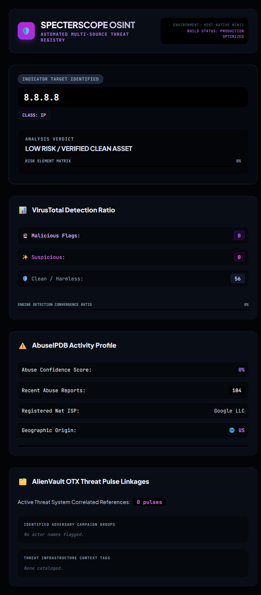

# 🔮 SpecterScope OSINT

SpecterScope OSINT is a high-performance, native threat intelligence orchestration tool designed to ingest, normalize, and compile real-time open-source intelligence (OSINT) diagnostics. This application eliminates manual cross-platform lookups by consolidating threat feeds into a premium, responsive visual dashboard.



## 🚀 Core Architectural Features
* **Automatic Indicator Routing:** Implements precise regex boundaries to handle and classify IPv4 assets versus cryptographic file signatures (MD5/SHA256) seamlessly on the fly.
* **Feed Convergent Matrix:** Queries and normalizes vast, vastly disparate JSON server payloads from **VirusTotal (v3)**, **AbuseIPDB (v2)**, and **AlienVault OTX** simultaneously.
* **Independent Interface Compiler:** Generates a custom, localized static HTML template leveraging a premium Tailwind CSS "Cyber-Midnight" theme without heavy local database or web server runtime overhead.
* **DevSecOps Key Sanitization:** Built using strict cryptographic security hygiene, parsing sensitive API authentication configurations safely via detached local `.env` runtime environments.

## 🛠️ Technical Stack
* **Language:** Python 3.11+
* **Networking & Parsing:** Requests, Dotenv, Re, Webbrowser
* **Interface & Aesthetics:** Tailwind CSS (CDN Engine), Colorama

## 🔧 Deployment and Setup
1. Clone the repository to your host OS:
   ```bash
   git clone [https://github.com/Hellthrone2005/specterscope-osint.git](https://github.com/Hellthrone2005/specterscope-osint.git)
   cd specterscope-osint